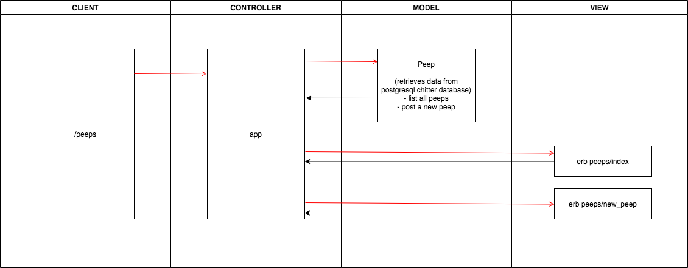

# Chitter App
This web app is a small Twitter clone that allows the users to post messages (peeps) and view the list of all peeps.
(challenge instructions can be found in the main README.md file here: https://github.com/Dhara-95/chitter-challenge/blob/master/README.md)

**Personal Note**
Overall I was pleased with the project and glad that I was able to create the basic funcionality of adding a new message to my 'chitter' database and retrieve that information within my Model file, which then printed the list of messages in reverse order in the browser (newest message first). 

I would improve this project by adding in the rest of the functionality that allows for the user to sign in and the list of peeps includes the username, message and a time stamp of when it was created. I was able to add a basic background colour to the brower pages, however I would also further improve the styling of thee app using CSS. 

**User Stories Completed**
---

```
As a Maker
So that I can let people know what I am doing  
I want to post a message (peep) to chitter

As a maker
So that I can see what others are saying  
I want to see all peeps in reverse chronological order

```

**Domain Model**
---
 

**How to use the app**
---
In command line clone this repo and run bundle to install all gems:
```
git clone https://github.com/Dhara-95/chitter-challenge 
bundle install
```

To set up the database:

- Connect to 'psql' and create the 'chitter' and 'chitter_test' databases

```
CREATE DATABASE chitter;
CREATE DATABASE chitter_test
```

To set up the appropriate tables, connect to each database in 'psql' and run the SQL scripts in the 'db/migrations' folder in the given order.


To run the BookManager App run the server in command line first:

```
rackup -p 9292
```
Then go to web browser and type in the url localhost:9292:
```
localhost:9292           (to view the homepage)
localhost:9292/peeps     (to view the list of peeps)
localhost:9292/peeps/new (to post a new peep)
```

To run the tests:

```
rspec
```
Current Test Coverage = 97.18%

To run linting:

```
rubocop
```